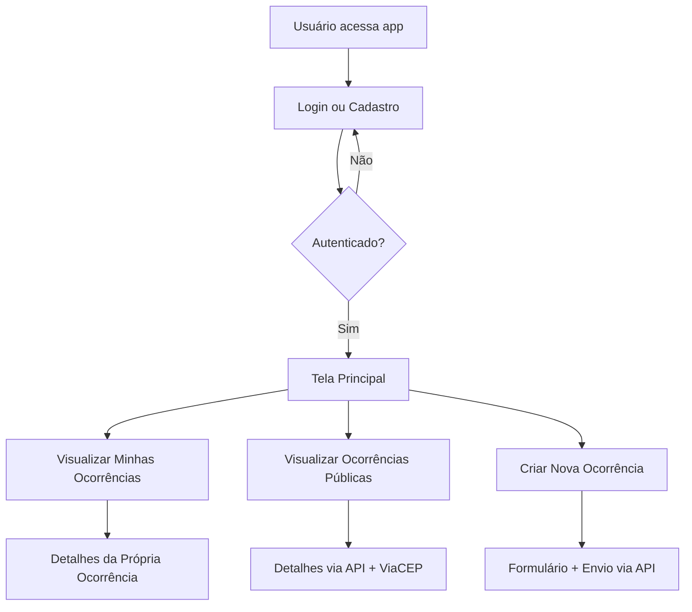

# ⚡ REDE-LUZ – Monitoramento Comunitário de Quedas de Energia

## 🔍 Visão Geral

O REDE-LUZ é uma solução tecnológica desenvolvida para possibilitar que cidadãos comuniquem, em tempo real, quedas de energia elétrica. Os dados reportados são armazenados e visualizados em um painel acessível via aplicativo, fortalecendo a comunicação entre usuários e autoridades responsáveis.

A aplicação foi desenvolvida como projeto interdisciplinar, com foco em **Resiliência de Sistemas**, **Cibersegurança**, **Engenharia de Software** e **Computação Móvel**.

---

## 🧩 Tecnologias Utilizadas

### 🌐 Back-End (API RESTful - .NET 8)
- ASP.NET Core
- Entity Framework Core
- SQL Server
- JWT (Autenticação)
- Testes via Postman

### 📱 Front-End (Aplicativo Mobile)
- React Native com Expo
- TypeScript
- Axios (consumo da API)
- React Navigation
- AsyncStorage (armazenamento de token)

---

## 🎯 Funcionalidades

### 👨‍💻 Usuários
- Cadastro com e-mail e senha
- Login seguro com token JWT

### ⚠️ Ocorrências
- Registro de nova ocorrência de queda de energia
- Consulta às ocorrências próprias
- Consulta de ocorrências públicas (de todos os usuários)
- Detalhamento completo da ocorrência, incluindo endereço via integração com ViaCEP

---

## 📋 Requisitos

### ✅ Requisitos Funcionais
- Permitir login e cadastro de usuários
- Cadastrar nova ocorrência de queda de energia
- Exibir todas as ocorrências registradas por um usuário
- Exibir todas as ocorrências públicas para consulta geral
- Exibir detalhes de uma ocorrência (data, tempo, localização)

### ❌ Requisitos Não Funcionais
- API segura com autenticação via JWT
- Banco de dados relacional com EF Core
- Interface amigável e responsiva (mobile)
- Código organizado com separação de responsabilidades (DTOs, Controllers, Models)

---

## 🧭 Fluxo do Sistema



---

## ⚙️ Como Executar o Projeto

### 🔧 Backend (.NET / C# 8)

1. Navegue até a pasta do back-end:
   ```bash
   cd back-end/REDE-LUZ.API/REDE-LUZ.API
   ```

2. Configure sua string de conexão no arquivo `appsettings.json`:
   ```json
   "ConnectionStrings": {
     "DefaultConnection": "Server=localhost;Database=RedeluzDb;Trusted_Connection=True;"
   }
   ```

3. Execute as migrations:
   ```bash
   dotnet ef database update
   ```

4. Rode o servidor:
   ```bash
   dotnet run
   ```

---

### 📱 Frontend (React Native)

1. Navegue até a pasta do front:
   ```bash
   cd front-end
   ```

2. Instale as dependências:
   ```bash
   npm install
   ```

3. Execute o app:
   ```bash
   npx expo start
   ```

---

## 🔐 Autenticação JWT

Após o login, o token JWT é salvo localmente (AsyncStorage). Ele é enviado automaticamente nos headers de requisição usando o Axios:

```ts
headers: {
  Authorization: `Bearer ${token}`
}
```

---

## 📁 Estrutura de Pastas

```
📦REDE-LUZ
├── back-end
│   └── REDE-LUZ.API
│       ├── Controllers
│       ├── DTOs
│       ├── Models
│       ├── Data
│       └── Program.cs
├── front-end
│   ├── screens
│   ├── navigation
│   ├── services
│   └── types
```

---

## 🧠 Regras de Negócio

- O CEP deve seguir o formato `00000-000` e ser válido
- A data de início da ocorrência não pode estar no futuro
- A duração da queda não pode ser menor que 1 minuto
- Apenas usuários autenticados podem registrar ou visualizar ocorrências

---

## 👨‍🏫 Equipe

- Gustavo Bonfim  
- Enzo Luiz  
- Lucas Yuji

---

## 📄 Licença

Este projeto é acadêmico e não possui licença comercial.
